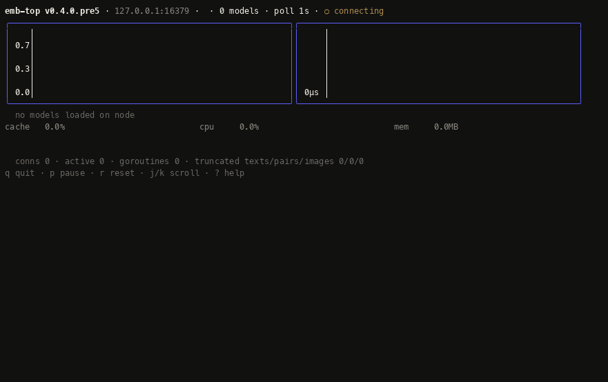

# Operations

## Health checks

`EMB.READY` returns `+OK` when the server is ready to serve traffic, or `-ERR`
with a reason (`loading`, `draining`, `no models`). Point your load balancer's
TCP health check at it, or use the client's `ready?`/`ready` helpers:

```bash
redis-cli EMB.READY
# → OK
```

```ruby
Emb.ready?  # => true
Emb.ready   # => "ready"
```

## Connection lifecycle

Three knobs bound the server's connection and request surface. `idle_timeout`
defaults to **15 minutes** (set `0` to disable reaping entirely); the two caps
default to `0` (unlimited).

```yaml
idle_timeout: 15m
max_connections: 100
max_concurrent_requests: 32
```

Equivalent flags: `-idle-timeout 15m`, `-max-connections 100`,
`-max-concurrent-requests 32`.

- `idle_timeout` reaps connections that stop sending commands, bounding file
  descriptors and zombie-diagnosis noise. Pooled Redis clients reconnect
  transparently; a long-idle interactive session is closed and must reconnect.
- `max_connections` refuses connections at the cap; refused sockets are closed
  immediately without being counted.
- `max_concurrent_requests` answers `EMB`/`EMB.MULTI` with `ERR busy ...` while
  at the cap, giving consumers backpressure instead of unbounded queueing.
  Control commands (`PING`, `AUTH`, `EMB.READY`, `EMB.STATS`, `EMB.MODELS`,
  `EMB.INFO`, `EMB.HELP`) always answer so ops can still probe a saturated
  server.

## Observability

`EMB.STATS` reports uptime, total requests, live `connections` and
`active_requests` (the real in-flight count), a per-model breakdown
(requests, avg latency, tokens, errors, pooling), live process resources
(`mem` = RSS MB, `cpu_user_usec`/`cpu_sys_usec`, `goroutines`), the cache
counters, and the effective
`idle_timeout_ms`/`max_connections`/`max_concurrent_requests` — a 10-second
check to classify a CPU/stuck-traffic incident as volume, saturation, or
churn (and to confirm no memory leak: RSS/goroutines flat between polls).

`MONITOR [seq] [limit]` exposes the last completed-request events (up to 8192,
oldest evicted) for per-request visibility: latency percentiles, error and
volume attribution per model. It is named after Redis's `MONITOR` but is a
bounded sequence-query rather than a long-lived stream — pass the last `seq`
you saw to fetch only newer events, which is how [`emb-top`](#monitoring-emb-top)
keeps its cost near zero. Request texts are never included.

`INFO [section...]` renders Redis-format sections; with no argument it returns
all of them:

- **# Server** — `redis_version`, `emb_version`, `uptime_secs`, `process_id`
- **# Cache** — hits, misses, hit rate, evictions, entries, byte usage
- **# Keyspace** — per-model `db0:model=…,keys=…,hits=…,misses=…,hit_rate=…`
- **# Stats** — `total_requests`, `total_tokens`, `total_errors`, `models_loaded`, `total_net_input_bytes`, `total_net_output_bytes`
- **# Memory** — `used_memory_rss_bytes` (process RSS incl. ONNX/CGo), `used_memory_heap_bytes`, `goroutines`, `total_system_memory_bytes`
- **# CPU** — `used_cpu_user_usec`, `used_cpu_sys_usec`, `gomaxprocs`
- **# Clients** — `active_requests`

`CONFIG GET [glob]` reads the live configuration registry (`CONFIG GET cache*`),
and `CONFIG SET` tunes it at runtime — including **live cache resizing**
(`CONFIG SET cache 1GB` evicts immediately) and swapping the `password` (affects
new connections only). Read-only parameters (listen address, TLS, models) are
reported by `GET` but rejected by `SET`. Both require authentication, matching
Redis semantics.

## Monitoring: emb-top

`emb-top` is a live terminal dashboard for a running `emb` node. It connects
over the Redis protocol and polls `EMB.MODELS` / `EMB.INFO <model>` /
`EMB.STATS` / `MONITOR` once per second — pipelined in a single round trip —
and renders:

- aggregate **req/s** and **p95 latency** stream charts,
- a model-activity **heatmap** (rows = models, columns = recent polls, color = req/s),
- per-model req/s, tok/s, err/s, **p50/p95/p99 latency** (from `MONITOR`
  events), and identity (dim, pooling, quantization, batching),
- cache hit ratio and hit/miss/eviction rates, RSS memory, CPU %, connections,
  active requests, goroutines, and a live event ticker,
- `AUTH` / TLS support, auto-reconnect with a connection-lost banner, and a
  headless `-once` mode for scripts and CI.

<!-- topviz:begin -->


*Captured 2026-09-15 · emb-top v0.4.0.pre5 · 4 models · 127.0.0.1:16379.*
<!-- topviz:end -->

```bash
# watch a node
emb-top -addr localhost:6379

# headless: machine-readable lines (rates + latency percentiles from MONITOR)
emb-top -addr localhost:6379 -once -samples 10 -interval 1s
# t=... total_requests=6 req_rate=2.0 tok_rate=11.0 cpu_pct=14.5 lat_p50_us=1139 lat_p95_us=1801 …

# secured node
emb-top -addr localhost:6379 -password secret -tls
```

Keys: `q` quit · `p`/space pause · `r` reset window · `j`/`k` scroll models ·
`?` help. Flags: `-addr`, `-interval`, `-password`, `-tls`, `-window`,
`-once -samples N`. Prefer the `EMB_TOP_PASSWORD` environment variable over
`-password` (command-line arguments are visible in process listings); sending a
password to a non-loopback address without `-tls` prints a warning. Terminal:
UTF-8; a color-capable terminal is recommended.

It ships inside the Docker image (`/usr/local/bin/emb-top`) and the
`emb-server` gem (`bin/emb-top`). It requires no `onnxruntime` — it is a pure
RESP client and builds with `CGO_ENABLED=0`.
