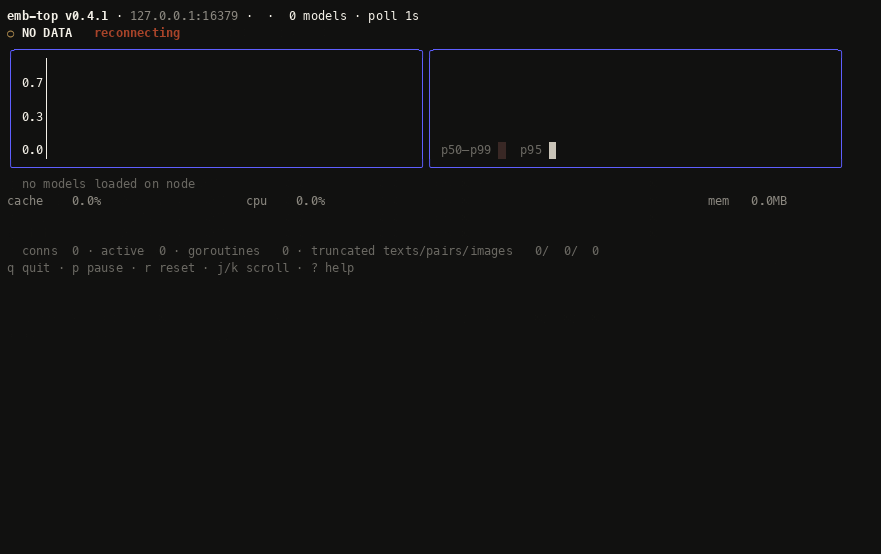
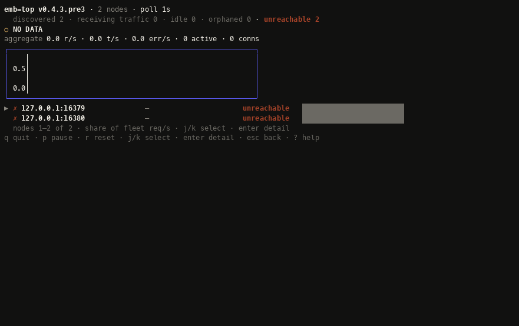

# Operations

## Health checks

`EMB.READY` returns `+OK` when the server is ready to serve traffic, or `-ERR`
with a reason (`loading`, `draining`, `no models`). Point your load balancer's
TCP health check at it, or use the client's `ready?`/`ready` helpers:

```bash
redis-cli EMB.READY
# → OK
```

```ruby
Emb.ready?  # => true
Emb.ready   # => "ready"
```

## Connection lifecycle

Three knobs bound the server's connection and request surface. `idle_timeout`
defaults to **15 minutes** (set `0` to disable reaping entirely); the two caps
default to `0` (unlimited).

```yaml
idle_timeout: 15m
max_connections: 100
max_concurrent_requests: 32
```

Equivalent flags: `-idle-timeout 15m`, `-max-connections 100`,
`-max-concurrent-requests 32`.

- `idle_timeout` reaps connections that stop sending commands, bounding file
  descriptors and zombie-diagnosis noise. Pooled Redis clients reconnect
  transparently; a long-idle interactive session is closed and must reconnect.
- `max_connections` refuses connections at the cap; refused sockets are closed
  immediately without being counted.
- `max_concurrent_requests` answers `EMB`/`EMB.MULTI` with `ERR busy ...` while
  at the cap, giving consumers backpressure instead of unbounded queueing.
  Control commands (`PING`, `AUTH`, `EMB.READY`, `EMB.STATS`, `EMB.MODELS`,
  `EMB.INFO`, `EMB.HELP`) always answer so ops can still probe a saturated
  server.

## Observability

`EMB.STATS` reports uptime, total requests, live `connections` and
`active_requests` (the real in-flight count), a per-model breakdown
(requests, avg latency, tokens, errors, pooling), live process resources
(`mem` = RSS MB, `cpu_user_usec`/`cpu_sys_usec`, `goroutines`), the cache
counters, and the effective
`idle_timeout_ms`/`max_connections`/`max_concurrent_requests` — a 10-second
check to classify a CPU/stuck-traffic incident as volume, saturation, or
churn (and to confirm no memory leak: RSS/goroutines flat between polls).

### Dispatch and run counters

`EMB.INFO <model>` and the per-model lines of `EMB.STATS` report, separately for
the script path (`script_*`) and the embedding path (`embed_*`):

- `dispatch_wait_us` — cumulative time requests spent waiting for a free
  session or worker
- `run_us` — cumulative ORT inference time
- `runs` — inference runs
- `sessions_busy` / `sessions_total` — live session occupancy

All are cumulative except the gauges, and reads are atomic. Derive an average
from two reads: `(wait_us₂ − wait_us₁) / (runs₂ − runs₁)` is the mean dispatch
wait per run, and the same for `run_us`. A serial workload keeps the mean wait
near zero; when concurrency exceeds `sessions_total`, the wait grows and
`sessions_busy` sits at `sessions_total`. A rising `run_us` at flat load points
at CPU contention (see the thread budget in
[configuration](./configuration.md#thread-budget)).

`MONITOR [seq] [limit]` exposes the last completed-request events (up to 8192,
oldest evicted) for per-request visibility: latency percentiles, error and
volume attribution per model. It is named after Redis's `MONITOR` but is a
bounded sequence-query rather than a long-lived stream — pass the last `seq`
you saw to fetch only newer events, which is how [`emb-top`](#monitoring-emb-top)
keeps its cost near zero. Request texts are never included.

`INFO [section...]` renders Redis-format sections; with no argument it returns
all of them:

- **# Server** — `redis_version`, `emb_version`, `uptime_secs`, `process_id`
- **# Cache** — hits, misses, hit rate, evictions, entries, byte usage
- **# Keyspace** — per-model `db0:model=…,keys=…,hits=…,misses=…,hit_rate=…`
- **# Stats** — `total_requests`, `total_tokens`, `total_errors`, `models_loaded`, `total_net_input_bytes`, `total_net_output_bytes`
- **# Memory** — `used_memory_rss_bytes` (process RSS incl. ONNX/CGo), `used_memory_heap_bytes`, `goroutines`, `total_system_memory_bytes`
- **# CPU** — `used_cpu_user_usec`, `used_cpu_sys_usec`, `gomaxprocs`
- **# Clients** — `active_requests`

`CONFIG GET [glob]` reads the live configuration registry (`CONFIG GET cache*`),
and `CONFIG SET` tunes it at runtime — including **live cache resizing**
(`CONFIG SET cache 1GB` evicts immediately) and swapping the `password` (affects
new connections only). Read-only parameters (listen address, TLS, models) are
reported by `GET` but rejected by `SET`. Both require authentication, matching
Redis semantics.

### Autotune state

`EMB.INFO <model>` also reports the script path's runtime autotune state:

- `script_traffic_class` — `idle`, `latency`, `throughput`, or `saturated`
- `script_inflight` — evaluations running right now
- `script_concurrency_current` — effective per-session allowance
- `script_concurrency_target` — the configured cap it may grow to
- `script_autotune_active` — 1 when the controller is adapting, 0 when fixed
  (`capacity: latency`/`throughput` or `autotune: off`)

Reading it is how you tell queueing from compute: `latency` with `inflight`
below `script_sessions` means capacity is idle; `throughput` means requests are
sharing sessions; `saturated` means CPU is the bottleneck and the controller
refuses to grow — expect a `script inference is CPU-saturated` log line and
raise `script_workers`/`intra_op_threads` rather than concurrency. The kill
switch is `autotune: off`, which pins the allowance at the configured value.
A `saturated` class with a high `dispatch_wait_us`/`run_us` ratio is the signal
that the model is under-provisioned, not under-shared.

### OTLP metrics export

`emb` can push the same metrics over OTLP/HTTP to any collector or vendor
backend. Export is off until an endpoint is configured:

```bash
./bin/emb -config config.yaml -otel-endpoint http://localhost:4318
```

See [Configuration → Telemetry](configuration.md#telemetry-opentelemetry) for the
settings and the standard `OTEL_*` variables. Counters are sent with delta
temporality, which is what Datadog's OTLP metrics intake expects.

**Datadog.** Two deployment shapes work:

*Through the Datadog Agent (same host):*

```yaml
# datadog.yaml
otlp_config:
  receiver:
    protocols:
      http:
        endpoint: 0.0.0.0:4318
```

```bash
OTEL_EXPORTER_OTLP_ENDPOINT=http://localhost:4318 \
OTEL_SERVICE_NAME=emb \
  ./bin/emb -config config.yaml
```

*Straight to Datadog's OTLP intake (no Agent, no Collector).* Use your site's
endpoint and API key; the `resource_attributes_as_tags` option turns the
resource attributes into Datadog tags:

```bash
OTEL_EXPORTER_OTLP_METRICS_ENDPOINT=https://otlp.datadoghq.com/v1/metrics \
OTEL_EXPORTER_OTLP_METRICS_PROTOCOL=http/protobuf \
OTEL_SERVICE_NAME=emb \
./bin/emb -config config.yaml \
  -otel-header "dd-api-key=$DD_API_KEY" \
  -otel-header 'dd-otel-metric-config={"resource_attributes_as_tags": true}'
```

Useful dashboard queries: `sum:emb.requests{service:emb}.as_count()` (req/s),
`sum:emb.requests{service:emb} by {model}.as_count()` (per-model),
`sum:emb.errors{service:emb}.as_count()`, `avg:emb.active_requests{service:emb}`,
and `avg:process.memory.usage{service:emb}`.

## Monitoring: emb-top

`emb-top` is a live terminal dashboard for a running `emb` node. It connects
over the Redis protocol and polls `EMB.MODELS` / `EMB.INFO <model>` /
`EMB.STATS` / `MONITOR` once per second — pipelined in a single round trip —
and renders:

- aggregate **req/s** and **p95 latency** stream charts,
- a model-activity **heatmap** (rows = models, columns = recent polls, color = req/s),
- per-model req/s, tok/s, err/s, **p50/p95/p99 latency** (from `MONITOR`
  events), and identity (dim, pooling, quantization, batching),
- cache hit ratio and hit/miss/eviction rates, RSS memory, CPU %, connections,
  active requests, goroutines, and a live event ticker,
- `AUTH` / TLS support, auto-reconnect with a connection-lost banner, and a
  headless `-once` mode for scripts and CI.

<!-- topviz:begin -->


*Captured 2026-10-05 · emb-top v0.4.1 · 4 models · 127.0.0.1:16379.*
<!-- topviz:end -->

```bash
# watch a node
emb-top -addr localhost:6379

# watch a fleet: -node is repeatable, -nodes is comma-separated
emb-top -node emb-0.internal -node emb-1.internal -interval 1s
emb-top -nodes 127.0.0.1:16379,127.0.0.1:16380

# a bare name is expanded to every A/AAAA record and re-resolved while watching
emb-top -nodes emb.internal

# headless: machine-readable lines (rates + latency percentiles from MONITOR)
emb-top -addr localhost:6379 -once -samples 10 -interval 1s
# t=... total_requests=6 req_rate=2.0 tok_rate=11.0 cpu_pct=14.5 lat_p50_us=1139 lat_p95_us=1801 …

# headless: stream the dashboard's own rendered frames (JSON lines)
emb-top -addr localhost:6379 -frames -interval 1s

# secured node
emb-top -addr localhost:6379 -password secret -tls

# TLS against a resolved address: verify the certificate against the name
emb-top -nodes emb.internal -tls -tls-server-name emb.internal
```

### Watching a fleet

With more than one node monitored, `emb-top` renders a cluster view: an
aggregate band above one row per node, each showing the node's share of fleet
requests against its `1/N` expectation, its own verdict, and an activity strip.
Select a row with `j`/`k` and press enter to open that node's per-model
dashboard; escape returns to the fleet. The single-node dashboard is unchanged
when exactly one node is monitored.



*Two nodes under load · emb-top watching `127.0.0.1:16379` and
`127.0.0.1:16380`. Re-record with `just website-clusterviz`.*

- `-node` is repeatable and `-nodes` is comma-separated; `-addr` stays a
  compatibility alias for a single node, and the `localhost:6379` default
  applies only when no node flag is given. Each entry is `host:port`, a bare
  `host` (default port 6379), or a DNS name. A bare name is expanded to one row
  per address record and re-resolved every 30s and immediately after a node
  goes unreachable, so an autoscaled node joins without restarting `emb-top`.
- Each node is polled on its own connection with its own event cursor, so a
  stalled node never delays another node's poll or the frame; its row keeps the
  last known values and how long ago they were sampled.
- Rows keep a stable first-seen order and never follow traffic. A node that
  stops resolving is marked **orphaned** while it still answers, and leaves the
  fleet only once it is both unresolved and unreachable for a grace period.
- A node that answers but receives no traffic is **idle**, distinct from
  **unreachable**. The header reports membership and traffic separately
  (`discovered · receiving traffic · idle · orphaned`).
- `emb-top` cannot see which nodes the *clients* were configured with — clients
  round-robin their own `url` list without consulting DNS — so an idle node is
  never called unbalanced, expected share is always `1/N`, and DNS weights are
  ignored. The fleet verdict is driven only by actionable cross-node signals:
  unreachable or auth-refusing nodes, a node far slower than the fleet median,
  a cold cache after a restart, and load spread beyond what the node count
  explains.
- A fleet of one (including the default `localhost:6379`) renders the original
  single-node dashboard, and `-once` / `-frames` keep their single-node output.
  With several nodes, `-once` prints the fleet aggregate followed by one
  `node:<label>` section per node, and `-frames` streams the fleet frame.

Keys: `q` quit · `p`/space pause · `r` reset window · `j`/`k` scroll models,
and select a node row in the fleet view · `enter` open the selected node ·
`esc` back to the fleet · `?` help. Flags: `-addr`, `-node`, `-nodes`,
`-interval`, `-password`, `-tls`, `-tls-server-name`, `-window`,
`-once -samples N`, `-frames`. `-frames` is the headless streaming mode: it
prints one complete, coloured frame per interval, so another process can render
the dashboard live without a terminal (the sandbox's read-only `/stats` view is
built on it). Prefer the `EMB_TOP_PASSWORD` environment variable over
`-password` (command-line arguments are visible in process listings); sending a
password to a non-loopback address without `-tls` prints a warning. Terminal:
UTF-8; a color-capable terminal is recommended.

It ships inside the Docker image (`/usr/local/bin/emb-top`) and the
`emb-server` gem (`bin/emb-top`). It requires no `onnxruntime` — it is a pure
RESP client and builds with `CGO_ENABLED=0`.
